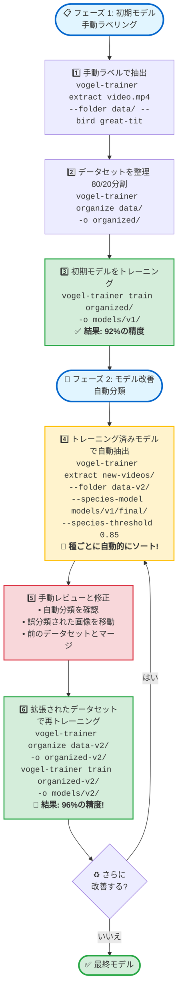

# 🐦 Vogel Model Trainer

**言語:** [🇬🇧 English](README.md) | [🇩🇪 Deutsch](README.de.md) | [🇯🇵 日本語](README.ja.md)

<p align="left">
  <a href="https://pypi.org/project/vogel-model-trainer/"></a>
  <a href="https://pypi.org/project/vogel-model-trainer/"></a>
  <a href="https://opensource.org/licenses/MIT"></a>
  <a href="https://pypi.org/project/vogel-model-trainer/"></a>
  <a href="https://pepy.tech/project/vogel-model-trainer"></a>
</p>

**YOLOv8とEfficientNetを使用して、独自の動画映像からカスタム鳥種分類器をトレーニング。**

特定の監視設定に合わせた高精度な鳥種分類器を作成するための専門ツールキット。動画からトレーニングデータを抽出し、データセットを整理し、96%以上の精度でカスタムモデルをトレーニングします。

---

## ✨ 機能

- 🎯 **YOLOベースの鳥検出** - YOLOv8を使用した動画と画像からの自動鳥切り出し
- 🖼️ **画像サポート** - 静止画像（JPG、PNG、BMP、TIFF）から鳥を抽出
- 🔄 **変換モード** - 検出なしで既存の鳥データセットを正規化
- 🤖 **3つの抽出モード** - 手動ラベリング、自動ソート、または標準抽出
- 📁 **ワイルドカード対応** - グロブパターンで複数の動画/画像をバッチ処理
- 🖼️ **柔軟な画像サイズ** - 224/384/448pxまたは元のサイズを保持
- 🔍 **高度なフィルタリング** - ボックスサイズ、ボケ検出、シャープネス、エッジ品質閾値
- 🔄 **重複検出** - 知覚ハッシュで類似画像を削除
- ✅ **品質チェック** - ボケた、小さすぎる、破損、または不適切な露出の画像を検出
- 🎨 **AI背景除去** - トレーニングに最適なグレーデフォルトで背景を除去
- 🧹 **データセット検証** - 自動チェックで透明/グレーデータセットをクリーニング
- 🧠 **EfficientNet-B0トレーニング** - 軽量で強力な分類モデル
- 🎨 **4レベルデータ拡張** - None/Light/Medium/Heavy強度オプション
- ⚡ **混合精度トレーニング** - 高速GPUトレーニングのためのFP16/BF16サポート
- 📊 **高度なトレーニングオプション** - 微調整のための13個の設定可能パラメータ
- 🔧 **データセット重複除去** - 知覚ハッシュで既存データセットをクリーニング
- ⏸️ **グレースフルシャットダウン** - Ctrl+C中断時にモデル状態を保存
- 🎯 **バッチ分類** - CSVエクスポートと自動振り分けで何千枚もの画像を分類
- 🌍 **完全なi18n対応** - 英語、ドイツ語、日本語の翻訳
- 📈 **種ごとのメトリクス** - 種ごとの詳細な精度内訳

## 🤖 事前学習済みモデル

**ドイツの庭鳥分類器** - すぐに使用可能！

Hugging Faceで、8種類の一般的なドイツの庭鳥を100%の検証精度で分類できる事前学習済みモデルを提供しています：

🔗 **[kamera-linux/german-bird-classifier](https://huggingface.co/kamera-linux/german-bird-classifier)**

**対応種:**
- Blaumeise（アオガラ）
- Grünling（アオカワラヒワ）
- Haussperling（イエスズメ）
- Kernbeißer（シメ）
- Kleiber（ゴジュウカラ）
- Kohlmeise（シジュウカラ）
- Rotkehlchen（ヨーロッパコマドリ）
- Sumpfmeise（ハシブトガラ）

**抽出時の使用方法:**
```bash
vogel-trainer extract video.mp4 \
  --folder ~/training-data/ \
  --species-model kamera-linux/german-bird-classifier \
  --remove-background \
  --crop-padding 20 \
  --sample-rate 20 --skip-blurry --deduplicate \
  --min-sharpness 150 --min-edge-quality 80
```

モデルは抽出中に検出された鳥を自動的に分類します！

---

## 🚀 クイックスタート

### インストール

#### 推奨: 仮想環境を使用

```bash
# 必要に応じてvenvをインストール（Debian/Ubuntu）
sudo apt install python3-venv

# 仮想環境を作成
python3 -m venv ~/venv-vogel

# 有効化
source ~/venv-vogel/bin/activate  # Windows: ~/venv-vogel\Scripts\activate

# パッケージをインストール
pip install vogel-model-trainer

# 自動検出: 適切なonnxruntimeバージョンをインストール（GPU vs CPU）
python -c "$(curl -fsSL https://raw.githubusercontent.com/kamera-linux/vogel-model-trainer/main/scripts/setup_onnxruntime.py)"

# または手動で:
# CUDAシステム（GPU）の場合: pip install vogel-model-trainer[gpu]
# CPU専用（Raspberry Pi）の場合: pip install vogel-model-trainer[cpu]
```

#### クイックインストール

```bash
# PyPIからインストール
pip install vogel-model-trainer

# ハードウェアに適したonnxruntimeをインストール
python scripts/setup_onnxruntime.py  # CUDAを自動検出してGPU/CPUバージョンをインストール

# またはソースからインストール
git clone https://github.com/kamera-linux/vogel-model-trainer.git
cd vogel-model-trainer
pip install -e .
python scripts/setup_onnxruntime.py
```

**ハードウェアサポート:**
- 🎮 **CUDA GPU**（NVIDIA） → `onnxruntime-gpu`を使用（高速な背景除去）
- 💻 **CPUのみ**（Raspberry Pi、ARM64など） → `onnxruntime`を使用（互換性あり)
```

### 基本的なワークフロー

```bash
# 1. 動画から鳥の画像を抽出
vogel-trainer extract video.mp4 --folder ~/training-data/ --bird kohlmeise

# 2. トレーニング/検証分割に整理
vogel-trainer organize ~/training-data/ -o ~/organized-data/

# 3. カスタム分類器をトレーニング
vogel-trainer train ~/organized-data/ -o ~/models/my-classifier/

# 4. トレーニング済みモデルをテスト
vogel-trainer test ~/models/my-classifier/ -d ~/organized-data/
```

---

## 📖 使用ガイド

### ライブラリとして使用（v0.1.2の新機能）

すべてのコア機能をPythonコードでプログラム的に使用できるようになりました:

```python
from vogel_model_trainer.core import extractor, organizer, trainer, tester

# 動画から鳥を抽出
extractor.extract_birds_from_video(
    video_path="video.mp4",
    output_dir="output/",
    bird_species="great-tit",
    detection_model="yolov8n.pt",
    species_model=None,
    threshold=0.5,
    sample_rate=3,
    resize_to_target=True
)

# 静止画像から鳥を抽出（v0.1.16の新機能）
extractor.extract_birds_from_image(
    image_path="photo.jpg",
    output_dir="output/",
    bird_species="great-tit",
    detection_model="yolov8n.pt",
    remove_bg=True,
    bg_transparent=True
)

# 既存の鳥クロップを変換（v0.1.16の新機能）
stats = extractor.convert_bird_images(
    source_dir="raw-data/",
    target_dir="processed-data/",
    remove_bg=True,
    bg_transparent=True,
    crop_padding=10,
    min_sharpness=80,
    deduplicate=True
)
print(f"変換済み: {stats['converted']}, スキップ: {stats['skipped_quality']}")

# トレーニング/検証分割に整理
organizer.organize_dataset(
    source_dir="output/",
    output_dir="dataset/",
    train_ratio=0.8
)

# モデルをトレーニング
trainer.train_model(
    data_dir="dataset/",
    output_dir="models/",
    model_name="google/efficientnet-b0",
    batch_size=16,
    num_epochs=50,
    learning_rate=3e-4
)

# モデルをテスト
results = tester.test_model(
    model_path="models/bird_classifier/",
    data_dir="dataset/"
)
print(f"精度: {results['accuracy']:.2%}")
```

### 1. トレーニング画像の抽出

vogel-model-trainerは**動画**と**静止画像**の両方を入力ソースとしてサポートするようになりました。

#### 🎬 動画抽出

YOLO検出を使用して動画ファイルから鳥クロップを抽出:

##### 手動モード（初期収集に推奨）

動画内の種がわかっている場合:

```bash
vogel-trainer extract ~/Videos/great-tit.mp4 \
  --folder ~/training-data/ \
  --bird great-tit \
  --threshold 0.5 \
  --sample-rate 3
```

##### 自動ソートモード（反復トレーニング用）

既存のモデルを使用して自動分類とソート:

```bash
vogel-trainer extract ~/Videos/mixed.mp4 \
  --folder ~/training-data/ \
  --species-model ~/models/classifier/final/ \
  --threshold 0.5
```

#### ワイルドカードでのバッチ処理

```bash
# ディレクトリ内のすべての動画を処理
vogel-trainer extract "~/Videos/*.mp4" --folder ~/data/ --bird blue-tit

# 再帰的なディレクトリ検索
vogel-trainer extract ~/Videos/ \
  --folder ~/data/ \
  --bird amsel \
  --recursive
```

**パラメータ:**
- `--folder`: 抽出された画像のベースディレクトリ（必須）
- `--bird`: 手動種ラベル（サブディレクトリを作成）
- `--species-model`: 自動分類用のトレーニング済みモデルへのパス
- `--species-threshold`: 種分類の最小信頼度（例: 0.85は85%）
- `--threshold`: YOLO信頼度しきい値（デフォルト: 0.5）
- `--sample-rate`: N番目のフレームごとに処理（デフォルト: 3）
- `--detection-model`: YOLOモデルパス（デフォルト: yolov8n.pt）
- `--image-size`: ターゲット画像サイズ（ピクセル単位、デフォルト: 224、0で元のサイズ）
- `--max-detections`: フレームごとの最大検出数（デフォルト: 10）
- `--min-box-size`: 最小バウンディングボックスサイズ（ピクセル単位、デフォルト: 50）
- `--max-box-size`: 最大バウンディングボックスサイズ（ピクセル単位、デフォルト: 800）
- `--quality`: JPEG品質 1-100（デフォルト: 95）
- `--skip-blurry`: ぼやけた/焦点の合っていない画像をスキップ（実験的）
- `--min-sharpness`: **NEW v0.1.9** - 最小シャープネススコア（ラプラシアン分散、一般的に100-300）
- `--min-edge-quality`: **NEW v0.1.9** - 最小エッジ品質（ソーベル勾配、一般的に50-150）
- `--save-quality-report`: **NEW v0.1.9** - 詳細な品質レポートを生成
- `--remove-background`: **🧪 実験的 v0.1.11** - AIで背景を除去(rembg)
- `--crop-padding`: **NEW v0.1.15** - 鳥の周りのマスクを拡張するピクセル数（足/くちばしなどの詳細を保持）
- `--bg-color [white|black|gray]`: **🧪 実験的 v0.1.11** - 背景色（デフォルト: gray）
- `--bg-model [u2net|u2netp|isnet-general-use]`: **🧪 実験的 v0.1.11** - 背景除去用AIモデル（デフォルト: u2net）
- `--bg-transparent`: **NEW v0.1.14** - 透明な背景でPNGを作成（デフォルト: 無効、グレー背景）
- `--no-bg-transparent`: **NEW v0.1.14** - 透明度を無効化、色付き背景を使用（デフォルト）
- `--bg-fill-black`: **NEW v0.1.14** - 黒いパディング領域を透明にする（--bg-transparentが必要、黒い羽根は保持）
- `--no-bg-fill-black`: **NEW v0.1.14** - 黒いパディング領域を不透明に保つ（デフォルト)
- `--deduplicate`: 重複/類似画像をスキップ（知覚ハッシュ）
- `--similarity-threshold`: 重複のための類似度しきい値 - ハミング距離 0-64（デフォルト: 5）
- `--recursive, -r`: ディレクトリを再帰的に検索
- `--log`: コンソール出力をログファイルに保存（`/var/log/vogel-kamera-linux/YYYY/KWXX/`）

**高度なフィルタリング例:**

```bash
# すべてのフィルタを使用した高品質抽出 (v0.1.15)
vogel-trainer extract video.mp4 \
  --folder data/ \
  --bird rotkehlchen \
  --threshold 0.6 \
  --min-box-size 80 \
  --max-box-size 600 \
  --min-sharpness 150 \
  --min-edge-quality 80 \
  --skip-blurry \
  --deduplicate \
  --save-quality-report \
  --remove-background \
  --crop-padding 20 \
  --bg-color gray \
  --bg-model u2net

# 詳細保持機能付き背景除去（推奨）
vogel-trainer extract video.mp4 \
  --folder data/ \
  --bird blaumeise \
  --remove-background \
  --crop-padding 20 \
  --bg-color gray \
  --bg-model isnet-general-use
```

#### 🖼️ 画像抽出（v0.1.16の新機能）

YOLO検出を使用して静止画像（JPG、PNG、BMP、TIFF）から鳥クロップを抽出:

```bash
# 単一画像
vogel-trainer extract photo.jpg --folder ~/training-data/ --bird amsel

# グロブパターンで複数の画像
vogel-trainer extract "~/photos/*.jpg" --folder ~/training-data/ --bird rotkehlchen

# 再帰的なディレクトリ検索
vogel-trainer extract ~/photos/ \
  --folder ~/training-data/ \
  --bird blaumeise \
  --recursive

# 背景除去と品質フィルタリング
vogel-trainer extract photo.jpg \
  --folder ~/training-data/ \
  --bird kohlmeise \
  --remove-background \
  --bg-transparent \
  --crop-padding 10 \
  --min-sharpness 100 \
  --save-quality-report

# 訓練済みモデルで自動分類
vogel-trainer extract photo.jpg \
  --folder ~/training-data/ \
  --species-model ~/models/classifier/final/ \
  --species-threshold 0.85

# 自動ソート付きバッチ処理
vogel-trainer extract "~/photos/*.jpg" \
  --folder ~/training-data/ \
  --species-model kamera-linux/german-bird-classifier \
  --recursive
```

**注:** すべての動画抽出パラメータ（フィルタリング、背景除去、品質管理）が画像抽出で利用可能です。

**🧪 背景除去（実験的 v0.1.11+、安定版 v0.1.14）:**

`--remove-background`機能は、AIベースのrembgライブラリを使用して鳥を背景から自動的にセグメント化します。

**NEW v0.1.14:** グレー背景が最適なトレーニングのためのデフォルトになりました！より小さなJPEGファイル、より良い互換性。

**NEW v0.1.15:** 鳥の詳細（足、くちばし、羽）を保持するクロップパディング機能！

- **クロップパディング（v0.1.15+）:**
  - `--crop-padding N`: 検出された鳥の周りのフォアグラウンドマスクをNピクセル拡張
  - 背景除去時に重要な詳細（足、くちばし、尾羽）の損失を防ぎます
  - 推奨値: 最適な結果のために`20`ピクセル
  - `--remove-background`フラグでのみ動作
  - 例: `--crop-padding 20`は鳥の周りに20ピクセル多く保持

- **モデル:**
  - `u2net`（デフォルト）: 最高の総合品質、~180MBダウンロード
  - `u2netp`: より高速、小型モデルで迅速な処理
  - `isnet-general-use`: 詳細な羽のための最高のエッジ品質

- **背景色:**
  - `white`（デフォルト）: クリーンな白背景（#FFFFFF）
  - `black`: 高コントラスト黒背景（#000000）
  - `gray`: ニュートラルグレー背景（#808080）

- **機能:**
  - 正確な鳥の分離のためのAIベースU²-Netセグメンテーション
  - 滑らかでプロフェッショナルなエッジのためのアルファマッティング
  - モルフォロジー演算による後処理
  - 複雑な背景（枝、葉、建物）に対応
  - さまざまな鳥の羽毛と細かい羽の詳細に対応

- **注意:** 初回使用時に~180MBモデルをダウンロード（その後キャッシュ）、`rembg>=2.0.50`依存関係が必要

**💡 透明背景でのトレーニング（NEW v0.1.15）:**

透明背景を持つPNG画像でトレーニングする場合、トレーナーは自動的に**ランダム背景拡張**を適用します：
- トレーニング中: 各画像はランダムなグレー/黒/白の背景を取得
- 検証/テスト中: 一貫した中立グレー背景
- **利点**: モデルは背景色ではなく鳥の特徴に焦点を当てることを学習
- **結果**: どの背景でも機能するより堅牢な分類器

この機能を使用するには、`--remove-background --bg-transparent`で抽出するだけです：
```bash
# 透明背景で抽出
vogel-trainer extract video.mp4 \
  --folder data/ \
  --bird rotkehlchen \
  --remove-background \
  --crop-padding 20 \
  --bg-transparent \
  --sample-rate 30

# トレーニング - ランダム背景が自動的に適用されます！
vogel-trainer train data/ --output-dir models/
```

**💡 公開モデルのベストプラクティス:**
```bash
# ニュートラルデータセットの推奨設定（v0.1.15）
# 固定グレー背景を使用（ファイルサイズ小、一貫性あり）
vogel-trainer extract video.mp4 \
  --folder data/ \
  --bird rotkehlchen \
  --remove-background \
  --crop-padding 20 \
  --bg-color gray \
  --sample-rate 30 \
  --skip-blurry \
  --deduplicate \
  --save-quality-report \
  --quality 98
```

### 2. データセットの整理

```bash
vogel-trainer organize ~/training-data/ -o ~/organized-data/
```

**🆕 v0.1.8の新機能: クラスバランス管理**

```bash
# クラスあたり最大100枚の画像に制限、15%の不均衡許容
vogel-trainer organize ~/training-data/ -o ~/organized-data/ --max-images-per-class 100 --tolerance 15

# カスタム制限と厳格な許容値
vogel-trainer organize ~/training-data/ -o ~/organized-data/ --max-images-per-class 50 --tolerance 10
```

**新しいパラメータ:**
- `--max-images-per-class`: クラスあたりの最大画像数（デフォルト: 制限なし）
  - この数を超える画像は自動的に削除されます
  - 大規模なクラスのサイズを管理し、データセットのバランスを向上させます
  
- `--tolerance`: 許容可能なクラス不均衡の割合（デフォルト: 15）
  - 0-10%: ✅ 良好な均衡（チェックマーク）
  - 10-15%: ⚠️ 警告（データセットはまだ使用可能）
  - >15%: ❌ エラー（より多くのデータが推奨）

**例の出力:**
```
最小画像数を持つクラス: coal-tit（75枚の画像）
最大画像数を持つクラス: great-tit（100枚の画像）
クラス間の不均衡: 14.9% ⚠️ 警告: クラス不均衡が10-15%です
```

80/20のトレーニング/検証分割を作成:
```
organized/
├── train/
│   ├── great-tit/      # 最大100枚まで
│   ├── blue-tit/       # 最大100枚まで
│   └── robin/          # 最大100枚まで
└── val/
    ├── great-tit/
    ├── blue-tit/
    └── robin/
```

### 3. 分類器のトレーニング

```bash
vogel-trainer train ~/organized-data/ -o ~/models/my-classifier/
```

**トレーニング設定:**
- ベースモデル: `google/efficientnet-b0` (850万パラメータ)
- オプティマイザー: コサインLRスケジュールを使用したAdamW
- 拡張: 回転、アフィン、カラージッター、ガウシアンブラー
- 正則化: 重み減衰0.01、ラベルスムージング0.1
- 早期停止: 7エポックの忍耐

**出力:**
```
~/models/my-classifier/
├── checkpoints/     # 中間チェックポイント
├── logs/           # TensorBoardログ
└── final/          # 最終トレーニング済みモデル
    ├── config.json
    ├── model.safetensors
    └── preprocessor_config.json
```

### 4. モデルのテスト

**単一画像のテスト:**
```bash
# 完全な出力（トップ5予測）
vogel-trainer test ~/models/final/ -i image.jpg
vogel-trainer test ~/models/final/ --image photo.jpg

# 短い形式（フラグなし）
vogel-trainer test ~/models/final/ image.jpg

# 出力:
# 🖼️  Classifying image: image.jpg
# 
# Results:
# ==================================================
# 1. kohlmeise      - 0.9850 (98.5%)
# 2. blaumeise      - 0.0120 (1.2%)
# 3. sumpfmeise     - 0.0025 (0.3%)
# 4. tannenmeise    - 0.0003 (0.0%)
# 5. haubenmeise    - 0.0002 (0.0%)
```

**検証セットのテスト:**
```bash
# 完全な検証データでモデルをテスト
vogel-trainer test ~/models/final/ -d ~/organized-data/
vogel-trainer test ~/models/final/ --data ~/dataset/

# 出力:
# 🧪 Testing on validation set: ~/organized-data/val
# ======================================================================
#    kohlmeise   : 5/5 = 100.0%
#    blaumeise   : 4/5 = 80.0%
#    rotkehlchen : 5/5 = 100.0%
# ======================================================================
# 📊 Overall accuracy: 14/15 = 93.3%
```

**パラメータ:**
- `model`: トレーニング済みモデルへのパス（必須）
- `-i, --image`: 単一画像をテスト（トップ5予測を表示）
- `-d, --data`: 検証セットをテスト（精度を計算）

**注意:** `-i`または`-d`のいずれかを指定する必要があります！

### 5. 画像分類（バッチ推論）

トレーニング済みモデルで大量の鳥画像を自動分類:

```bash
# CSVエクスポート付きシンプル分類
vogel-trainer classify ~/models/final/ ~/camera-trap-images/ \
  --csv-report results.csv

# 種別に画像を自動振り分け
vogel-trainer classify ~/models/final/ ~/camera-trap-images/ \
  --sort-output ~/sorted-birds/

# 信頼度閾値付き（高信頼度分類のみ振り分け）
vogel-trainer classify ~/models/final/ ~/camera-trap-images/ \
  --sort-output ~/sorted-birds/ \
  --min-confidence 0.85

# フル機能: CSV + 振り分け + トップ3予測
vogel-trainer classify ~/models/final/ ~/camera-trap-images/ \
  --csv-report results.csv \
  --sort-output ~/sorted-birds/ \
  --top-k 3 \
  --batch-size 32
```

**ファイル管理オプション:**

```bash
# デフォルト: コピー（元ファイルは残る）
vogel-trainer classify ~/models/final/ ~/images/ \
  --sort-output ~/sorted/

# コピーの代わりに移動（ディスク容量節約）
vogel-trainer classify ~/models/final/ ~/images/ \
  --sort-output ~/sorted/ \
  --move

# 処理後にソースディレクトリを削除
vogel-trainer classify ~/models/final/ ~/images/ \
  --sort-output ~/sorted/ \
  --delete-source

# 組み合わせ: 移動 + ソースディレクトリクリーンアップ
vogel-trainer classify ~/models/final/ ~/images/ \
  --sort-output ~/sorted/ \
  --move \
  --delete-source

# ドライラン（変更なしでシミュレート）
vogel-trainer classify ~/models/final/ ~/images/ \
  --sort-output ~/sorted/ \
  --delete-source \
  --dry-run

# スクリプト用: 確認プロンプトをスキップ
vogel-trainer classify ~/models/final/ ~/images/ \
  --sort-output ~/sorted/ \
  --delete-source \
  --force
```

**パラメータ:**
- `model`: トレーニング済みモデルへのパス（必須）
- `input`: 分類する画像を含むディレクトリ（必須）
- `--sort-output, -s`: 種別に振り分けられた画像の出力ディレクトリ
- `--min-confidence`: 振り分けの最小信頼度閾値（0.0-1.0、デフォルト: 0.0）
- `--csv-report, -c`: 詳細な分類結果のCSVファイル
- `--top-k, -k`: レポートするトップ予測数（1-5、デフォルト: 1）
- `--batch-size, -b`: 処理バッチサイズ（デフォルト: 32）
- `--move`: コピーの代わりにファイルを移動（ディスク容量節約）
- `--delete-source`: ⚠️ 処理後にソースディレクトリを削除
- `--force, -f`: 確認プロンプトをスキップ（自動化用）
- `--dry-run`: 実際のファイル変更なしで操作をシミュレート
- `--no-recursive`: トップレベルの画像のみ処理

**CSV形式:**
```csv
filename,predicted_species,confidence,top_2_species,top_2_confidence,top_3_species,top_3_confidence
bird001.jpg,シジュウカラ,0.9750,ヤマガラ,0.0180,コマドリ,0.0045
bird002.jpg,ツグミ,0.9200,コマドリ,0.0520,アトリ,0.0210
```

**出力構造:**
```
sorted-birds/
├── シジュウカラ/    # シジュウカラとして分類
├── ヤマガラ/       # ヤマガラとして分類
├── コマドリ/       # コマドリとして分類
└── unknown/       # 信頼度閾値未満
```

**使用例:**
- 📸 **カメラトラップ分析**: 何千枚もの写真の自動種同定
- 🔍 **市民科学**: 趣味のバードウォッチャーが写真を分類
- 📊 **モニタリングプロジェクト**: 鳥類個体群の時系列分析
- ✅ **データセット品質**: 既存のデータセットの誤分類をチェック

**安全上の注意:**
- ⚠️ `--delete-source`はソースディレクトリを**完全に削除**します
- 💡  常に最初に`--dry-run`でプレビュー
- 📦 `--delete-source`使用前にバックアップを作成
- ✅ `--move`の方が安全（元ファイルはsorted/に残る）

### 6. 画質チェック（新機能！）

データセットの低品質画像（ぼやけ、小さすぎる、破損、露出問題）をチェック:

```bash
# 品質問題を削除せずに表示
vogel-trainer quality-check ~/training-data/ --recursive

# 低品質画像を削除
vogel-trainer quality-check ~/training-data/ \
  --mode delete \
  --recursive

# 低品質画像を別フォルダに移動
vogel-trainer quality-check ~/training-data/ \
  --mode move \
  --recursive

# より厳格なぼやけ検出
vogel-trainer quality-check ~/training-data/ \
  --blur-threshold 150.0 \
  --recursive

# 明るさ/コントラストの問題をチェック
vogel-trainer quality-check ~/training-data/ \
  --check-brightness \
  --recursive

# カスタムしきい値で包括的な品質チェック
vogel-trainer quality-check ~/training-data/ \
  --blur-threshold 120.0 \
  --min-resolution 100 \
  --min-filesize 2048 \
  --check-brightness \
  --mode move \
  --recursive
```

**品質チェックパラメータ:**
- `--blur-threshold`: 最小鮮明度スコア（Laplacian分散）、低い=ぼやけ（デフォルト: 100.0）
- `--min-resolution`: 最小画像幅/高さ（ピクセル）（デフォルト: 50）
- `--min-filesize`: 最小ファイルサイズ（バイト）（デフォルト: 1024）
- `--check-brightness`: 明るさ/コントラスト問題もチェック（暗すぎる、明るすぎる）
- `--mode`: アクション: `report`（表示のみ、デフォルト）、`delete`（削除）、`move`（low_quality/に移動）
- `--recursive, -r`: サブディレクトリを再帰的に検索

**⚠️ 警告 - 削除モード:**
- `--mode delete`オプションは**バックアップなしでファイルを永久に削除**します
- **常に最初に`--mode report`を実行**して、削除される内容をプレビューしてください
- 削除モードを使用する前に**データセットをバックアップ**してください
- 代わりに`--mode move`を検討してください（`low_quality/`フォルダにファイルを保持）

**チェック内容:**
- ✅ **鮮明度**: Laplacian分散を使用してぼやけた/ピンぼけ画像を検出
- ✅ **解像度**: トレーニングに悪影響を与える小さすぎる画像をフィルタ
- ✅ **ファイルサイズ**: 破損または空のファイルを検出
- ✅ **可読性**: 画像が開いて処理できるかをチェック
- ✅ **明るさ**（オプション）: 暗すぎる、または明るすぎる画像を検出

**典型的なしきい値:**
- ぼやけ: 100.0（デフォルト）=中程度、150.0=厳格、50.0=寛容
- 解像度: 50px（デフォルト）=非常に寛容、100px=推奨、224px=厳格
- ファイルサイズ: 1024バイト（デフォルト）=破損ファイルを検出

**推奨ワークフロー:**
```bash
# 1. 最初に問題をプレビュー（安全）
vogel-trainer quality-check ~/data/ --mode report --recursive

# 2. 問題のある画像を移動（可逆）
vogel-trainer quality-check ~/data/ --mode move --recursive

# 3. low_quality/フォルダで移動されたファイルを確認
# 4. 満足したら手動で削除: rm -rf ~/data/low_quality/
```

---

## 🔄 反復トレーニングワークフロー

自動分類を使用した反復的な改善でモデルの精度を向上させます：



**主なメリット:**
- 🚀 **高速ラベリング**: 自動分類で手動作業を削減
- 📈 **精度向上**: より多くのトレーニングデータ = より良いモデル
- 🎯 **品質管理**: `--species-threshold`で不確実な予測をフィルタリング
- 🔄 **継続的改善**: 各反復でモデルが改善

**コマンド例:**

```bash
# フェーズ 1: 手動トレーニング（初期データセット）
vogel-trainer extract ~/Videos/batch1/*.mp4 --folder ~/data/ --bird great-tit
vogel-trainer organize ~/data/ -o ~/data/organized/
vogel-trainer train ~/data/organized/ -o ~/models/v1/

# フェーズ 2: トレーニング済みモデルで自動分類
vogel-trainer extract ~/Videos/batch2/*.mp4 \
  --folder ~/data-v2/ \
  --species-model ~/models/v1/final/ \
  --species-threshold 0.85

# ~/data-v2/<species>/フォルダ内の分類を確認
# 誤分類された画像を正しい種のフォルダに移動

# データセットをマージして再トレーニング
cp -r ~/data-v2/* ~/data/
vogel-trainer organize ~/data/ -o ~/data/organized-v2/
vogel-trainer train ~/data/organized-v2/ -o ~/models/v2/
```

---

## 🎯 使用例

### 例 1: 単一種のデータセット作成

```bash
# ステップ 1: シジュウカラの動画を収集
vogel-trainer extract ~/Videos/great-tit-*.mp4 \
  --folder ~/data/birds/ \
  --bird great-tit

# ステップ 2: データセットを整理
vogel-trainer organize ~/data/birds/ -o ~/data/organized/

# ステップ 3: モデルをトレーニング
vogel-trainer train ~/data/organized/ -o ~/models/tit-classifier/
```

### 例 2: トレーニング済みモデルでデータセットを拡張

```bash
# 既存のモデルを使用して新しい動画から自動的にソート
vogel-trainer extract ~/Videos/new-footage-*.mp4 \
  --folder ~/data/expanded/ \
  --species-model ~/models/tit-classifier/final/

# 手動で不正確な分類を確認して修正
# ... 画像を手動で整理 ...

# 拡張されたデータセットで再トレーニング
vogel-trainer organize ~/data/expanded/ -o ~/data/organized-v2/
vogel-trainer train ~/data/organized-v2/ -o ~/models/tit-classifier-v2/
```

### 例 3: 複数種の分類器

```bash
# 各種の動画を収集
vogel-trainer extract ~/Videos/great-tit/ --folder ~/data/ --bird great-tit --recursive
vogel-trainer extract ~/Videos/blue-tit/ --folder ~/data/ --bird blue-tit --recursive
vogel-trainer extract ~/Videos/robin/ --folder ~/data/ --bird robin --recursive

# データセットを整理してトレーニング
vogel-trainer organize ~/data/ -o ~/data/organized/
vogel-trainer train ~/data/organized/ -o ~/models/multi-species/
```

---

## 💡 ヒントとベストプラクティス

### データ収集

- 📹 **多様な照明条件** - さまざまな時間帯と天候で動画を収集
- 🎬 **複数のカメラ角度** - さまざまな視点から
- 🐦 **種ごとに200+画像** - より高い精度のため
- 🎯 **品質重視** - `--threshold 0.5`以上を使用
- 📊 **バランスの取れたデータセット** - 各種でほぼ同じ数の画像

### トレーニング

- 🔄 **反復アプローチ** - 小規模から始めて、モデルを使用して拡張
- 📈 **早期停止を監視** - 過学習を避ける
- 💾 **チェックポイントを保持** - 最高のエポックに戻る
- 🎨 **データ拡張** - デフォルトの拡張で十分
- ⚡ **GPU推奨** - Raspberry Pi 5はトレーニングに対応していますが遅い

### テスト

- ✅ **検証セット** - データの20%をトレーニングしないでおく
- 🎯 **種ごとの指標を確認** - 弱い種を特定
- 📊 **混同種** - 類似種にはより多くのトレーニングデータが必要
- 🔍 **誤分類を検査** - 共通のエラーパターンを学ぶ

---

## 🏗️ 技術スタック

- **検出**: YOLOv8n (Ultralytics)
- **分類**: EfficientNet-B0 (Hugging Face Transformers)
- **トレーニング**: PyTorch + Accelerate
- **データ処理**: OpenCV, PIL, NumPy
- **CLI**: argparse

---

## 📊 パフォーマンス

| 指標 | Raspberry Pi 5 | 標準PC (GPU) |
|------|-----------------|--------------|
| 抽出速度 | ~5-10 FPS | ~30-60 FPS |
| トレーニング時間 | ~3-4時間 (500画像) | ~20-30分 |
| モデル精度 | >96% | >96% |
| モデルサイズ | ~17MB | ~17MB |

---

## 🐛 既知の問題

- 手動ラベリングモードは未実装（標準抽出+手動ソートを使用）
- 自動ソートモードは未実装（標準抽出+手動ソートを使用）
- GUIインターフェースなし（CLIのみ）

---

## 🔮 今後の計画

- 抽出中のインタラクティブな手動ラベリング
- 事前トレーニング済みモデルを使用した自動種ソート
- 追加のモデルアーキテクチャのサポート
- リアルタイムトレーニング監視ダッシュボード
- データセット拡張プリセット
- 組み込みデバイス向けモデル最適化

---

## 🤝 コントリビューション

コントリビューションを歓迎します！[CONTRIBUTING.md](CONTRIBUTING.md)をご覧ください。

---

## 🔒 セキュリティ

セキュリティ脆弱性を発見した場合は、[SECURITY.md](SECURITY.md)をご覧ください。

---

## 📄 ライセンス

このプロジェクトはMITライセンスの下でライセンスされています - 詳細は[LICENSE](LICENSE)ファイルをご覧ください。

---

## 🙏 謝辞

- **Ultralytics** - 優れたYOLOv8実装
- **Hugging Face** - Transformersライブラリ
- **PyTorchチーム** - ディープラーニングフレームワーク
- **コントリビューター** - このプロジェクトのテストと改善に協力してくれたすべての人に感謝します！

---

## 📞 サポート

- 🐛 **バグレポート**: [Issues](https://github.com/kamera-linux/vogel-model-trainer/issues)
- 💬 **ディスカッション**: [Discussions](https://github.com/kamera-linux/vogel-model-trainer/discussions)
-  **ドキュメント**: [README.md](README.md)

---

**Happy Training! 🐦🎉**
